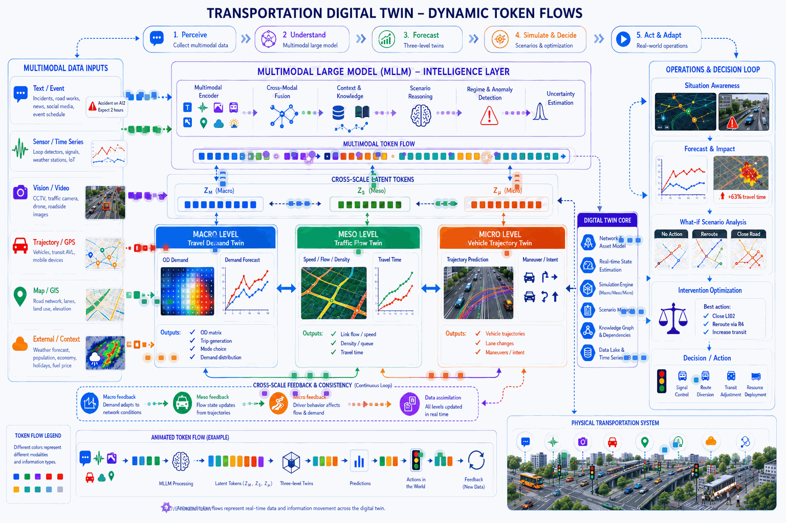
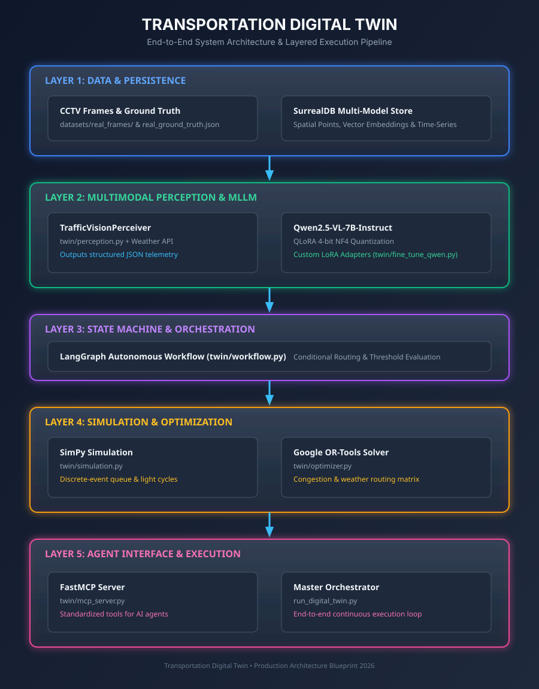
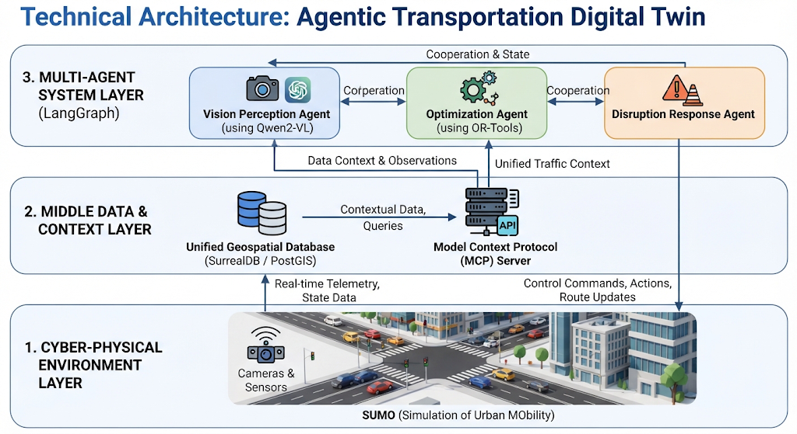
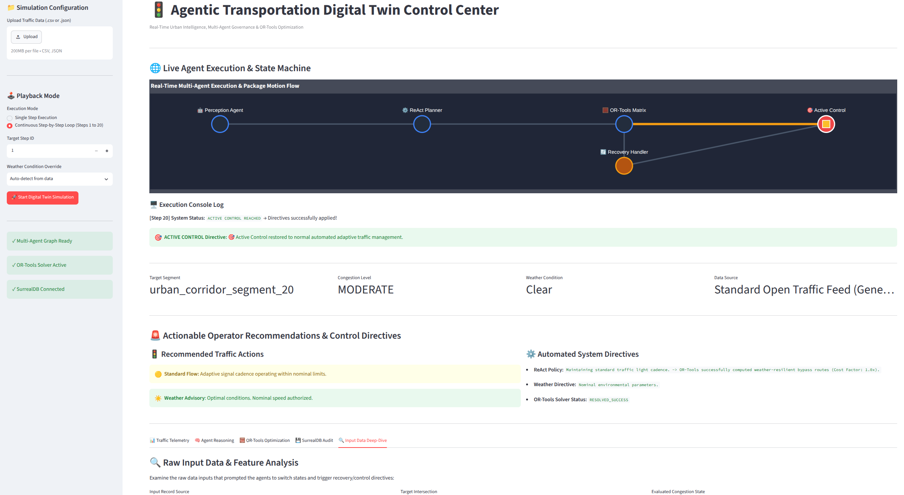

# 🚀 AI, LLM, RAG, MLLMs, Meta-Learning, Continual Learning, XAI & Agentic Transportation Digital Twins

This repository documents an end-to-end journey into **Large Language Models (LLMs)**, **Multimodal Large Language Models (MLLMs)**, **Meta-Learning**, **Continual Learning**, **Multimodal Explainability (XAI)**, **Retrieval-Augmented Generation (RAG)**, **Vector Databases**, and **Agentic AI Systems** applied to complex cyber-physical environments.

Rather than simply reading about these topics, this repository focuses on building state-of-the-art, simulation-backed **Agentic Digital Twins** from the ground up using cutting-edge open and proprietary models capable of adapting, learning, and explaining their actions in real time.

---

# 🎯 Multimodal Transportation Digital Twin

---

# 🎯 Objectives

By completing this repository:

* Master Large Language Models and multi-agent coordination loops.
* Leverage state-of-the-art **Multimodal LLMs** (such as **Qwen2-VL** and Meta's **Muse Glimmer**) to parse live CCTV feeds, maps, and visual telemetry.
* Build autonomous **AI Agents** capable of reasoning, planning, tool-calling, and failure recovery using the **ReAct framework** and **Model Context Protocol (MCP)**.
* Implement **Meta-Learning** algorithms to enable few-shot adaptation to entirely new urban layouts or unseen intersection topologies.
* Prevent catastrophic forgetting via **Continual Learning** strategies when transitioning across seasonal weather shifts.
* Unpack black-box decisions using **Multimodal Explainability (XAI)** techniques to generate human-interpretable audit trails.
* Interface MLLMs and AI agents with deterministic mathematical optimization solvers (e.g., **Google OR-Tools**) for optimal routing.
* Design, simulate, and deploy a production-grade **Transportation Digital Twin** that is **Environment-Aware** (weather, visibility, road conditions).

---

# 📚 Project Roadmap

## Module 1 — Foundations
* Introduction to LLMs, Transformers, Attention Mechanisms, and Context Windows.

## Module 2 — Advanced Multimodal Foundations (MLLMs) & Perception
* Vision-Language Models, spatial-temporal grounding, and processing live traffic camera streams (CCTV) using **Qwen2-VL** and **Meta Muse Glimmer**.
* **Weather & Environmental Perception:** Training agents to detect visibility, precipitation, and adverse surface conditions from video streams.

## Module 3 — Embeddings & Unified Digital Twin Databases
* Vector indexing, spatial-vector search, and managing multi-model structures via **SurrealDB** or **PostgreSQL + PostGIS + pgvector**.

## Module 4 — Retrieval-Augmented Generation (RAG) & Agentic RAG
* Document loading, chunking, vector indexing, retrieval, context injection, and system-specific retrieval loops for dynamic operational policies (e.g., weather response protocols).

## Module 5 — Agentic Architectures & Tool Use
* **ReAct & Self-Correction Loops:** Reasoning, planning, tool execution, and error handling.
* **Model Context Protocol (MCP):** Exposing real-time digital twin states (including weather telemetry) natively to AI agents.
* **Deterministic Solvers:** Coupling agent decisions with mathematical optimization engines (OR-Tools) to compute weather-resilient routes.

## Module 6 — Multi-Agent Orchestration
* Multi-agent collaboration, role decomposition, task delegation, and consensus mechanisms using **LangGraph**.

## Module 7 — Advanced Multimodal Architectures (MLLMs in Depth)
* Cross-modal alignment, vision-language projectors, and native tokenization of continuous video feeds and telemetry tensors.

## Module 8 — Meta-Learning for Rapid Spatial Adaptation
* **Few-Shot Adaptation to Unseen Urban Zones:** Utilizing Model-Agnostic Meta-Learning (MAML) and Reptile loops to allow the digital twin to instantly adapt its control logic to unfamiliar layouts with minimal local data.

## Module 9 — Continual Learning & Mitigating Catastrophic Forgetting
* **Lifelong Urban Adaptation:** Mitigating forgetting when the digital twin encounters drastic seasonal transitions (e.g., dry summer flows to heavy winter blizzards) using parameter-efficient continual learning and rehearsal buffers.

## Module 10 — Multimodal Explainability (XAI) & Auditing
* **Interpretable Agent Decisions:** Unpacking black-box MLLM choices via multimodal attention rollout, integrated gradients, and concept bottleneck layers.
* **Causal Audit Trails:** Generating human-readable rationale graphs explaining why optimization routes were modified.

## Module 11 — Capstone: The Weather-Aware Agentic Transportation Digital Twin
* Integrating traffic simulation engines (SUMO/SimPy), spatial databases, and MLLM multi-agent systems to simulate extreme weather scenarios and real-time disruption responses.

---

# 🧠 Spotlight: SOTA Architecture of the Transportation Digital Twin

The capstone project models a **Generative Agentic Digital Twin** that bridges real-time telemetry with autonomous agentic action:

1. **The Cyber-Physical Environment:** Simulated via **SUMO / SimPy** mimicking real-world intersections, transit lines, and vehicle fleets. Environmental variables (rain, snow, fog) are dynamically applied via the **TraCI** interface.
2. **The Data & Context Layer:** Powered by **SurrealDB** or **PostGIS** for unified spatial, vector, and time-series storage, exposed to agents via the **Model Context Protocol (MCP)**.
3. **The Multi-Agent Team (LangGraph & Local MLLMs):**
   * **Vision & Perception Agent:** Powered by **Muse Glimmer 30B** or **Qwen2-VL**, parsing live CCTV feeds and weather states.
   * **Optimization Agent:** Translates agent insights into mathematical parameters for deterministic solvers (**Google OR-Tools**) to compute routes accounting for reduced capacity/speed.
   * **Disruption Response Agent:** Handles unexpected blockages or severe weather conditions, executing self-correction and failure-recovery protocols.
   * **Meta-Adaptation & XAI Auditor:** Dynamically shifts agent weights based on historical context and logs step-by-step explanatory rationales for every control decision.

---

# 🎯 Architecture Diagram

---

# 🛠 Technology Stack

| Category | SOTA Tools & Frameworks |
| --- | --- |
| Language | Python |
| **Multimodal LLMs (Local)** | **Meta Muse Glimmer (30B)** / **Qwen2-VL**, Hugging Face `transformers`, `vLLM` |
| **Meta-Learning & Continual Learning** | `learn2learn`, Avalanche (`avalanche-lib`), PEFT/LoRA adapters |
| **Explainability & XAI** | Captum, SHAP, Attention Rollout visualization, LangGraph Tracing |
| **Agent Frameworks** | LangGraph / OpenAI Agents SDK |
| **Agent Interoperability** | Model Context Protocol (MCP) |
| **Optimization Solvers** | Google OR-Tools / Gurobi |
| **Transport Simulation** | SimPy / SUMO / OSMnx / NetworkX |
| **Unified Database & Spatial** | **SurrealDB** (Graph + Spatial + Time-Series + Vectors) *or* PostGIS + pgvector |
| **Backend & Frontend** | FastAPI, Streamlit, Docker Compose |

---

# 📖 Learning Progress

| Lesson | Topic | Status |
| --- | --- | --- |
| 01 | LLMs & Transformer Foundations | ✅ |
| 02 | MLLM Perception (Vision & Weather) | ⏳ |
| 03 | Unified Vector & Spatial Databases | ⏳ |
| 04 | RAG & Agentic RAG | ⏳ |
| 05 | ReAct Agents, Failure Recovery & MCP | ⏳ |
| 06 | MLLMs + Mathematical Solvers (OR-Tools) | ⏳ |
| 07 | Multi-Agent Orchestration (LangGraph) | ⏳ |
| 08 | Advanced MLLM Fine-Tuning & Deployment | ⏳ |
| 09 | Meta-Learning for Rapid Spatial Adaptation | ⏳ |
| 10 | Continual Learning & Mitigating Forgetting | ⏳ |
| 11 | Multimodal Explainability (XAI) & Auditing | ⏳ |
| 12 | Building the Transport Digital Twin (SUMO) | ⏳ |
| 13 | Production Deployment & Monitoring | ⏳ |

---

# 📚 References & Reference Documents

### Foundation Models, MLLMs & Adaptation
* **Attention Is All You Need** (Vaswani et al., 2017).
* **Qwen2-VL: Enhancing Vision-Language Models for SOTA Visual Perception** (Alibaba Group).
* **Muse Glimmer: Open-Weights Multimodal Agentic Models** (Meta).
* **Model-Agnostic Meta-Learning for Fast Adaptation of Deep Networks** (Finn et al., 2017).
* **Continual Lifelong Learning with Deep Networks: A Review** (Parisi et al., 2019).

### Explainability, Agentic Frameworks & Digital Twins
* **ReAct: Synergizing Reasoning and Acting in Language Models** (Yao et al., 2022).
* **Model Context Protocol (MCP) Specification** — *Standardized context connectors for AI agents.*
* **LangGraph Documentation** — *Stateful multi-actor application architecture.*
* **A Survey on Explainable Artificial Intelligence (XAI) for Multimodal Systems** (2024–2025).
* **LLM-Powered Digital Twins for Interactive Urban Mobility Simulation** (OpenReview, 2025).

### Transportation & Environmental Spatial Systems
* **SurrealDB Multi-Model Architecture Whitepaper**.
* **OSMnx: New Methods for Complex Street Networks** (Boeing, 2017).
* **Impact of Adverse Weather on Traffic Flow Characteristics** (Transportation Research Board).

---

# 🚦 Agentic Transportation Digital Twin Control Center

An advanced, real-time multi-agent urban intelligence system powered by **LangGraph**, **Google OR-Tools**, and **SurrealDB**. This control center monitors regional traffic telemetry, evaluates weather conditions, executes automated policy plans, records continual adaptation metrics, and exposes XAI audit trails to eliminate traffic bottlenecks safely.

---

## ✨ Key Dashboard Features

* **🤖 Interactive Multi-Agent Workflow Graph:** Visualizes live data packet motion in real time across LangGraph nodes (`Perception`, `ReAct Planner`, `Meta-Adapter`, `OR-Tools Matrix`, `Recovery Handler`, and `XAI Auditor`).
* **🕹️ Flexible Simulation Playback Modes:** Supports single-step inspections or continuous automated multi-step loops (expanding up to 20+ simulation steps).
* **💬 Live Node-to-Directive Mapping & XAI Traces:** Displays real-time agent reasoning text, feature attribution heatmaps, and operator recommendations directly below the workflow graph.
* **🔍 Input Data Deep-Dive Tab:** Allows operators to inspect raw JSON payloads, environmental overrides, and sensor speed distributions to compare *why* and *when* agents trigger recovery protocols.
* **💾 SurrealDB Audit Trail:** Automatically persists execution records, meta-learning adaptation weights, and historical telemetry for post-hoc analysis.

---

## 🏗️ Architecture & Workflow

The digital twin processes traffic streams through a directed graph state machine:

1. **🤖 Perception Agent:** Ingests camera feeds and sensor metrics to assess surface congestion levels.
2. **🧠 Meta-Adapter Node:** Instantly calibrates parameters for unseen networks using meta-learning priors.
3. **⚙️ ReAct Planner:** Evaluates contextual scenarios and determines tactical response policies.
4. **🧮 OR-Tools Matrix:** Applies optimization algorithms with weather friction multipliers (rain, fog, snow) to compute optimal routing.
5. **🔄 Recovery Handler:** Engages automatically during critical bottlenecks or incidents to dispatch emergency routing.
6. **📊 XAI Auditor:** Computes attention rollouts and provides step-by-step natural language explanations for compliance.
7. **🎯 Active Control:** The success node that locks in and applies final signal cadences and corridor directives.

---

# 📈 Contributions & ⭐ Support

Contributions, suggestions, and pull requests are welcome! If you find this cutting-edge repository helpful, please consider giving it a ⭐.